# Prop Gallery

Every propeller in [`props/`](props/) designed by `proply-rs` with the
coupled lifting-line / vortex design loop (STEP output; see
[proply-rs/README.md](proply-rs/README.md)) and rendered headlessly with
FreeCAD via [`props/renderprop.py`](props/renderprop.py).

To regenerate everything after changing a prop JSON, the design code, or the
render script:

```sh
make gallery
```

This designs each prop into `build/out/<name>.step` and renders it to
`images/<name>.png`. Each entry links the prop's JSON parameters and its
YAML design summary (`build/out/<name>.yml`: motor operating point,
performance totals — RPM, thrust, torque, power, efficiencies — and the
per-station section list). Props are listed below alphabetically; diameter
is twice the design radius, and V is the forward airspeed the prop is
designed for (0 = static/hover).

## LD1510_2200kv

[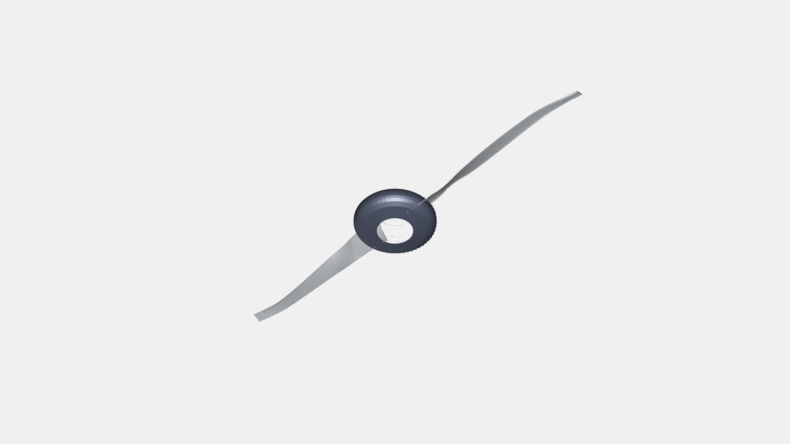](images/LD1510_2200kv.png)

2 blades, Ø 125 mm — LD1510 2200 Kv @ 7.4 V, 2 N thrust, V = 20 m/s.
[JSON](props/LD1510_2200kv.json) · [YAML](build/out/LD1510_2200kv.yml)

## dji_phantom3

[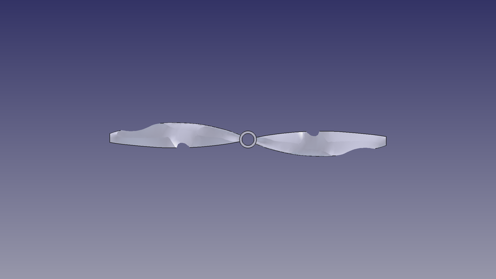](images/dji_phantom3.png)

2 blades, Ø 228 mm — DJI Phantom 3 stock motor, 800 Kv @ 14.8 V, 12 N thrust,
static. [JSON](props/dji_phantom3.json) · [YAML](build/out/dji_phantom3.yml)

## dys_1806_2300kv

[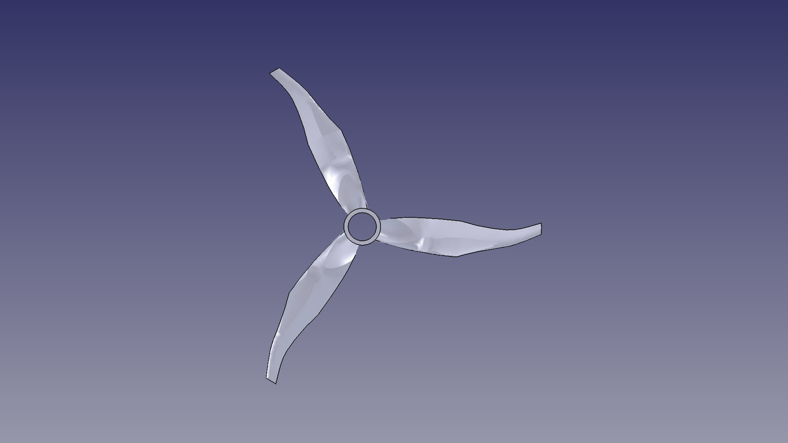](images/dys_1806_2300kv.png)

3 blades, Ø 127 mm — DYS 1806 2300 Kv @ 11 V, 5 N thrust, static.
[JSON](props/dys_1806_2300kv.json) · [YAML](build/out/dys_1806_2300kv.yml)

## dys_2814_910kv

[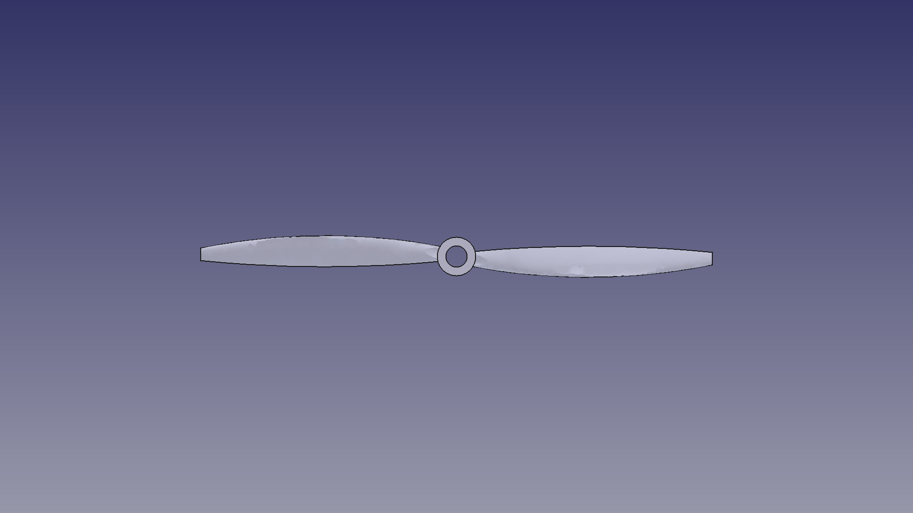](images/dys_2814_910kv.png)

2 blades, Ø 240 mm — DYS 2814 910 Kv @ 11 V, 8 N thrust, static.
[JSON](props/dys_2814_910kv.json) · [YAML](build/out/dys_2814_910kv.yml)

## flywoo_robo_rb1202.5_11500kv

[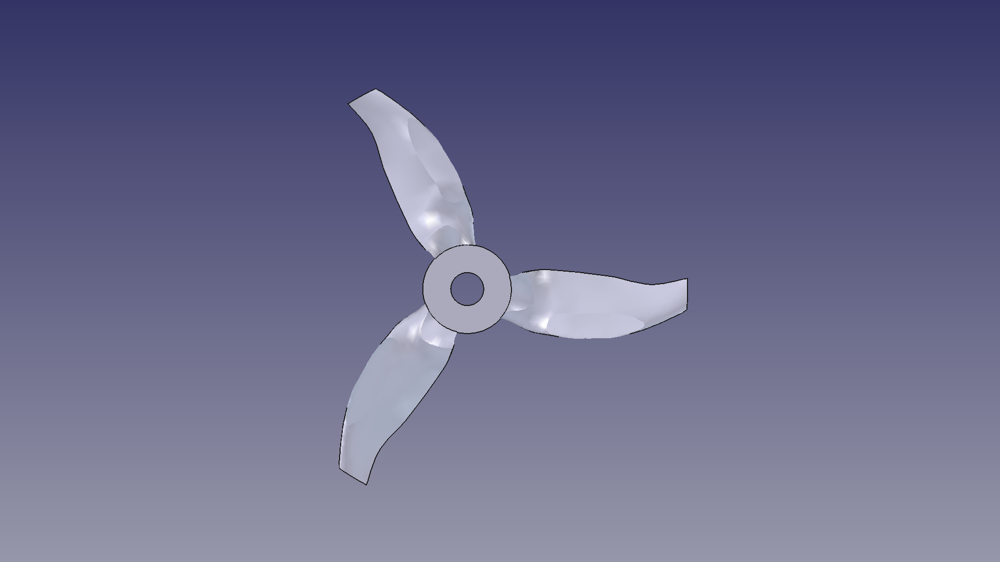](images/flywoo_robo_rb1202.5_11500kv.png)

3 blades, Ø 40 mm — Flywoo Robo RB1202.5 11500 Kv @ 3.7 V (1S), 0.5 N thrust,
static. [JSON](props/flywoo_robo_rb1202.5_11500kv.json) · [YAML](build/out/flywoo_robo_rb1202.5_11500kv.yml)

## multistar_1704_1900kv

[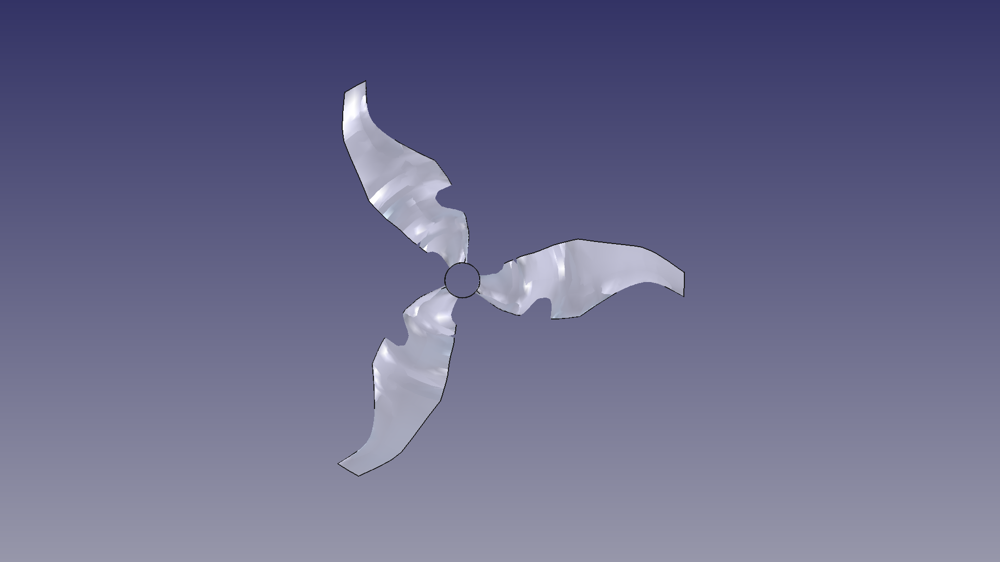](images/multistar_1704_1900kv.png)

3 blades, Ø 127 mm — Multistar 1704 1900 Kv @ 11 V, 5 N thrust, static.
[JSON](props/multistar_1704_1900kv.json) · [YAML](build/out/multistar_1704_1900kv.yml)

## multistar_2209_980kv

[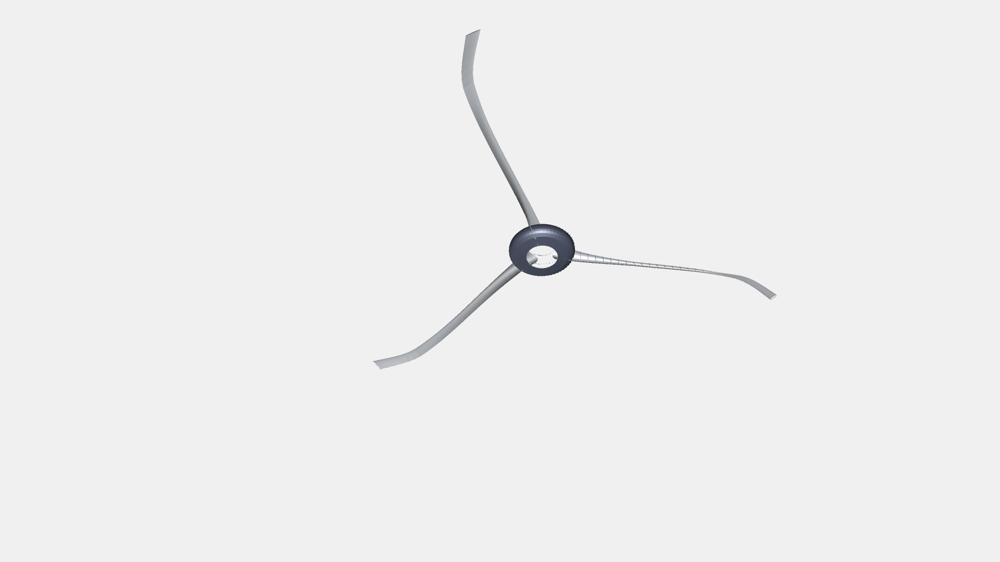](images/multistar_2209_980kv.png)

5 blades, Ø 125 mm — Multistar 2209 980 Kv @ 11 V, 5 N thrust target,
V = 20 m/s. The design converges to ~2.9 N, short of the 5 N target —
this parameter set is energetically marginal at 20 m/s forward speed.
[JSON](props/multistar_2209_980kv.json) · [YAML](build/out/multistar_2209_980kv.yml)

## ntm_28_26_1200Kv

[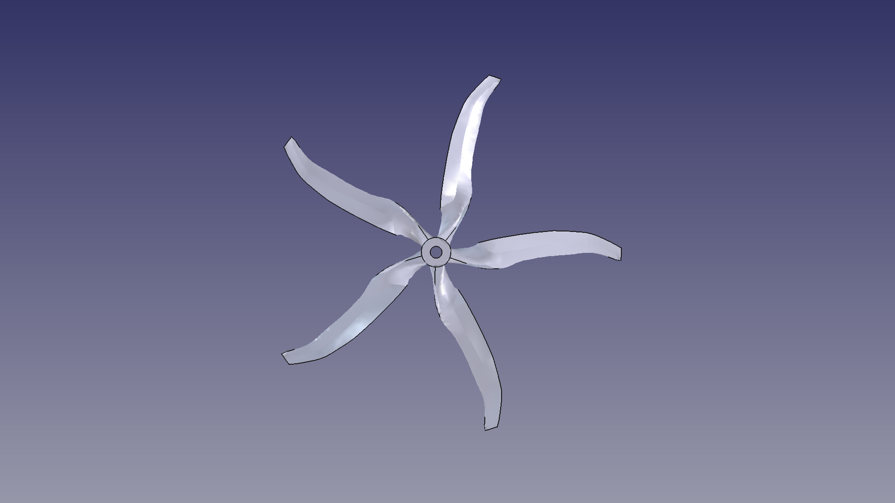](images/ntm_28_26_1200Kv.png)

5 blades, Ø 125 mm — NTM 28-26 1200 Kv @ 12 V, 5 N thrust, V = 2 m/s.
[JSON](props/ntm_28_26_1200Kv.json) · [YAML](build/out/ntm_28_26_1200Kv.yml)

## ntm_propdrive_28_36

[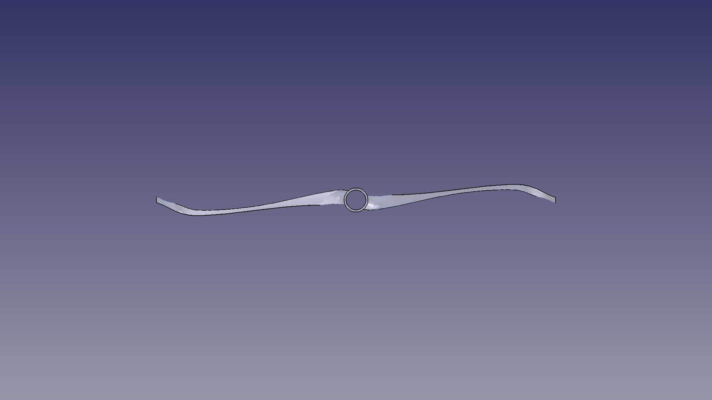](images/ntm_propdrive_28_36.png)

2 blades, Ø 200 mm — NTM Propdrive 28-36 750 Kv @ 16.7 V, 40 N thrust,
V = 2 m/s. [JSON](props/ntm_propdrive_28_36.json) · [YAML](build/out/ntm_propdrive_28_36.yml)

## ntm_propdrive_42_48_650kv

[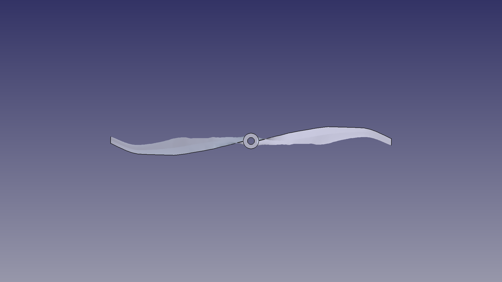](images/ntm_propdrive_42_48_650kv.png)

2 blades, Ø 400 mm — NTM Propdrive 42-48 650 Kv @ 16.7 V, 40 N thrust,
V = 40 m/s. [JSON](props/ntm_propdrive_42_48_650kv.json) · [YAML](build/out/ntm_propdrive_42_48_650kv.yml)

## rotax_912_uls

[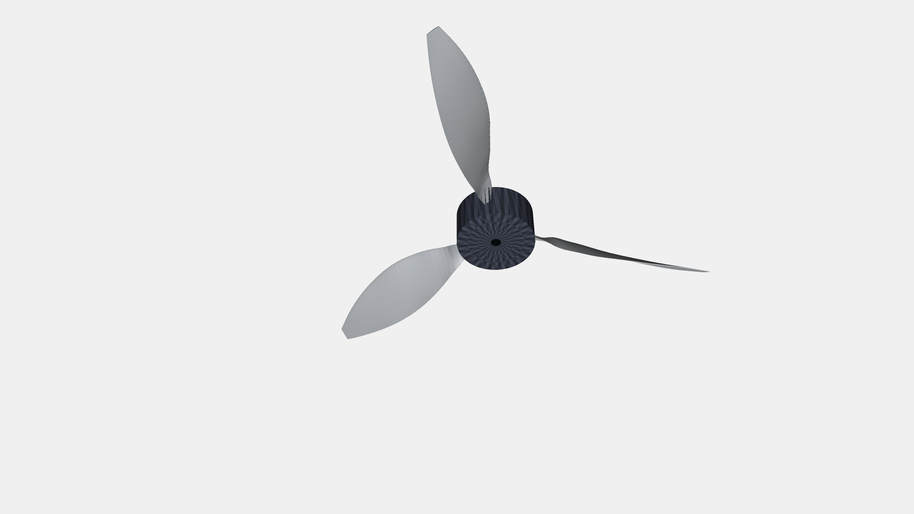](images/rotax_912_uls.png)

2 blades, Ø 1000 mm — Rotax 912 ULS aircraft engine (334.8 N m at 1950 RPM),
1000 N thrust, V = 45 m/s cruise.
[JSON](props/rotax_912_uls.json) · [YAML](build/out/rotax_912_uls.yml)

## silly_plane

[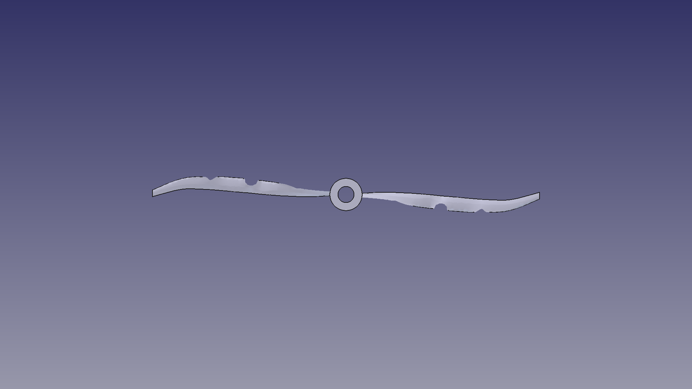](images/silly_plane.png)

2 blades, Ø 1200 mm — paraglider motor (MP202/80 KV28), 30 N thrust,
V = 40 m/s. [JSON](props/silly_plane.json) · [YAML](build/out/silly_plane.yml)

## test_prop

[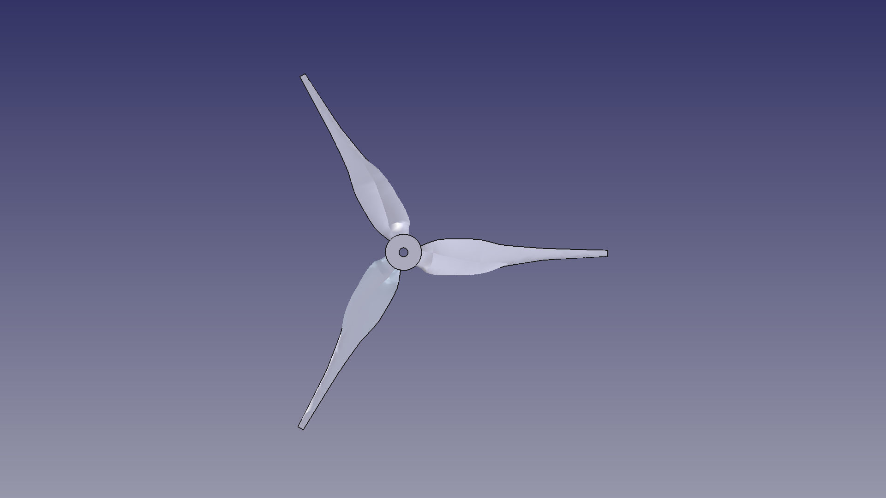](images/test_prop.png)

3 blades, Ø 136 mm — Multistar 1706-class 5 in prop on 3S, 3 N thrust,
V = 3 m/s. A physically realizable reference case: three blades lower the
per-blade loading so the design converges at every station.
[JSON](props/test_prop.json) · [YAML](build/out/test_prop.yml)

## turnigy_CA_120

[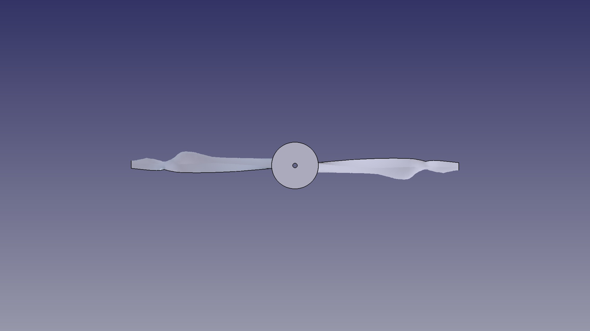](images/turnigy_CA_120.png)

2 blades, Ø 700 mm — Turnigy CA120 150 Kv (100 cc equivalent), 200 N thrust,
V = 25 m/s. [JSON](props/turnigy_CA_120.json) · [YAML](build/out/turnigy_CA_120.yml)
